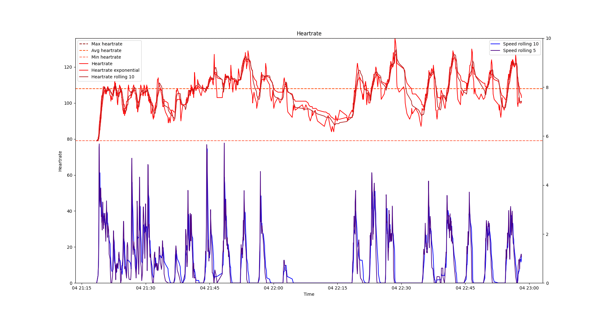

# ShiftAnalyzer
Python programm to load Garmin TCX files an plot them with MATPLOTLIB.

Analyze hockey games for shift length, average heartrate during shifts, bench times, number of shifts and further more

