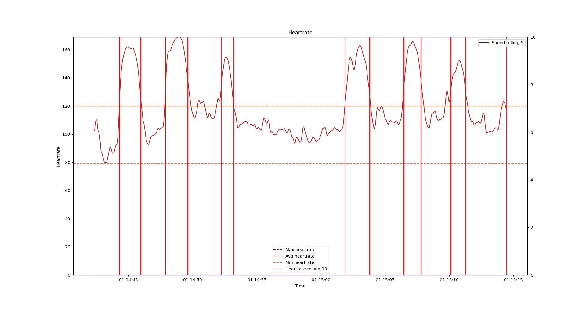

# ShiftAnalyzer
Python programm to load Garmin TCX files an plot them with MATPLOTLIB.

Analyze hockey games for shift length, average heart rate during shifts, bench times, number of shifts and further more

For the first figure I used the Polar H10 to get better heart rate data for analyzing shifts based solely on heart rate. This is needed for games inside of arenas where ther e is no GPS data

